# Team Economy · 团队经济/梭哈吧，史蒂夫

[English README](README_EN.md)

当前版本：**1.0.1**。

[下载 1.0.1](https://github.com/Evoltsuki/Team_Economy/releases/tag/v1.0.1) · [源码仓库](https://github.com/Evoltsuki/Team_Economy) · [更新日志](CHANGELOG.md) · [问题反馈](https://github.com/Evoltsuki/Team_Economy/issues)

  

Team Economy 是适用于 Minecraft 生存模式的经济与小游戏模组，提供物资回收、积分商店和六种实体游戏设备。玩家通过出售材料获得点数，用于采购物资、升级设备权限和参与游戏。与 FTB Teams 联动时，同队成员共享钱包和设备等级。

*A survival economy mod with material recycling, shared team wallets, and six playable game machines. Available for Minecraft 1.20.1, 1.21 and 1.21.1 on Forge / NeoForge; see the version table below.*

[下载与安装](#installation) · [玩法指南](docs/试玩指南.md) · [服主配置](docs/平衡配置指南.md) · [常用指令](#commands) · [反馈问题](#feedback)

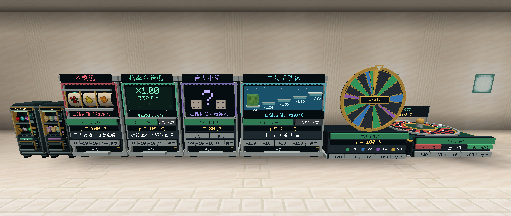

## 功能介绍

### 物资回收与积分商店

自动售货机与 `/teamecon shop` 提供商品采购、物资回收和等级升级功能。「出售」页设有 **27 格待售区**，支持整批报价与确认出售，收入计入当前钱包。商品支持分类筛选，以及名称、全拼、拼音首字母、物品 ID 和 `#标签` 搜索；例如，`jinding` 或 `jd` 可检索金锭。

商店按玩家保存上次使用的页签，重启游戏后自动恢复；首次打开进入「商品」页。

购买价与回收价分别计算。同类材料的累计出售量影响市场需求及回收报价，部分商品需完成对应的原版进度后购买。

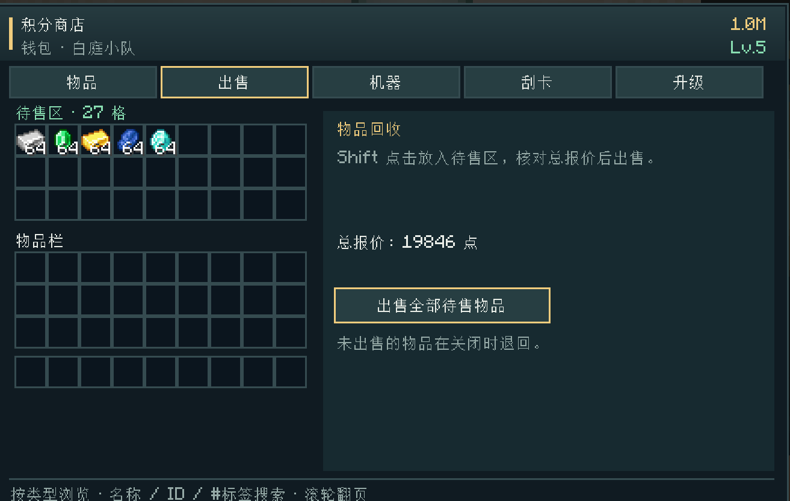

### 团队钱包与设备等级

安装 **FTB Teams** 后，同队成员共用钱包和**五级设备权限**。回收、采购、升级与游戏的收支统一记入团队钱包，侧栏显示队伍余额和成员净收支。

未安装 FTB Teams 时使用个人钱包，全部小游戏均可使用。设备权限由钱包等级决定，商品的原版进度要求按购买玩家判断；加入队伍时，个人余额与团队余额分别保留。

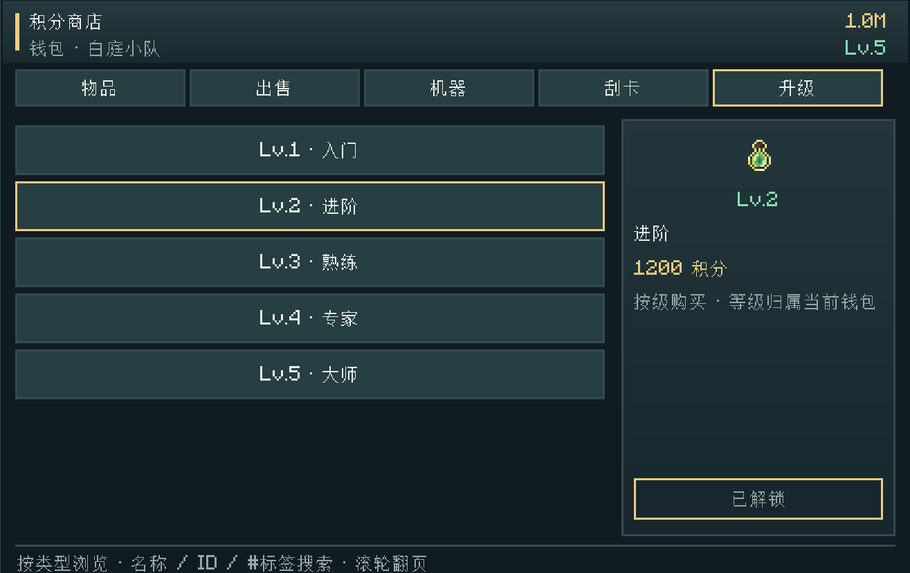

### 实体游戏设备

六种游戏均以可放置的实体设备呈现。右键机身按钮可选择玩法、调整下注金额并开始游戏。

| 游戏 | 默认解锁 | 玩法 |
|---|---|---|
| 猜大小机 | Lv.1 | 选择大或小，按 1–10 的随机数字结算 |
| 史莱姆跳冰 | Lv.2 | 跳向下一块冰，成功后决定继续还是提取 |
| 幸运转盘 | Lv.3 | 转动彩色轮盘，按指针落点结算 |
| 黑红轮盘 | Lv.4 | 选择红、黑或单号，按轮盘落点结算 |
| 老虎机 | Lv.5 | 按三轴停止后的图案组合结算 |
| 倍率竞猜 | Lv.5 | 在倍率上涨时选择提取，崩盘则本局归零 |

多台设备可同时运行，各自独立计时、操作和结算；无线终端使用独立场次。每台设备在当前场次结束后向其他玩家开放。下注从当前钱包扣除，奖励结算至原出资钱包，待结算场次随存档保存。

等级升级解锁设备使用权限，设备通过合成或购买获取。各游戏的操作、概率与配方见[玩法指南](docs/试玩指南.md)。

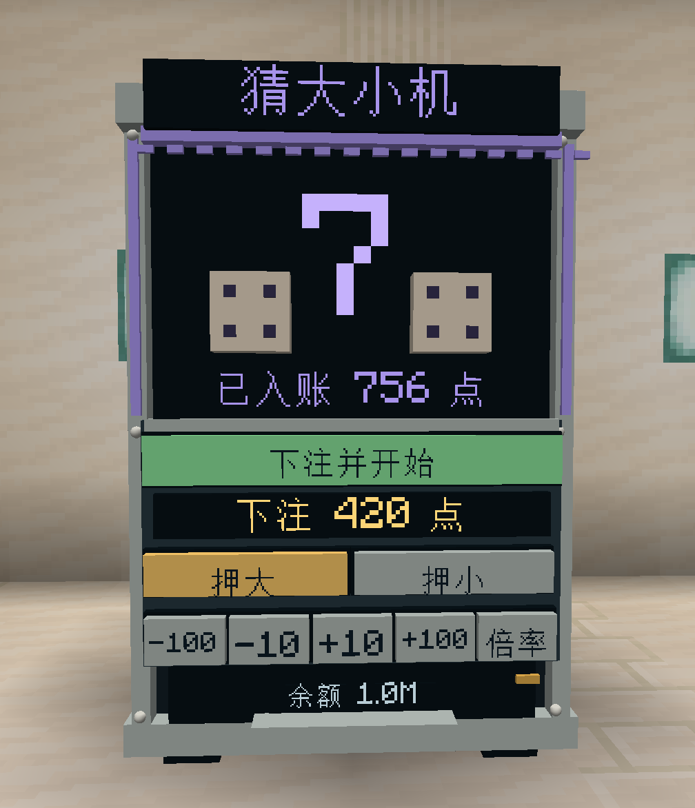

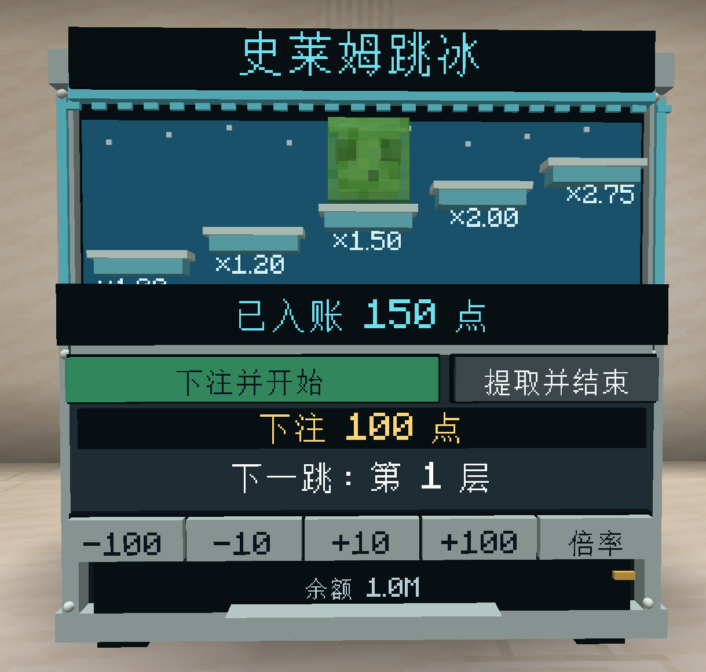

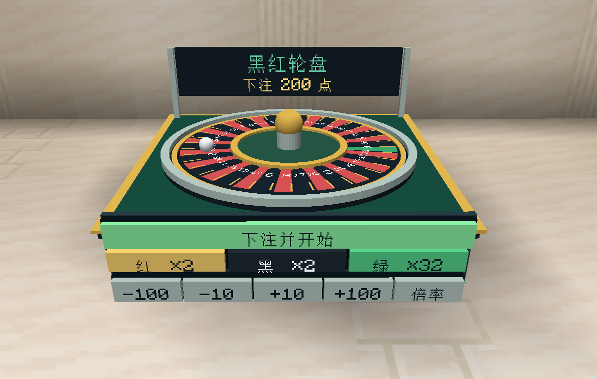

### 刮刮卡与盲盒

**八种实体刮刮卡**按等级开放，包含幸运数字、皇冠大奖等玩法。主手持卡时左键打开界面，拖动刮开涂层后自动结算。

**盲盒机**支持奖池预览和 1／10／64 盒批量开启。奖品格右上角标注中奖概率，下方「×N」标注数量；默认奖池包含材料、稀有物品、刷怪蛋及治疗、抗火、水肺等药水，支持喷溅和滞留药水类型。

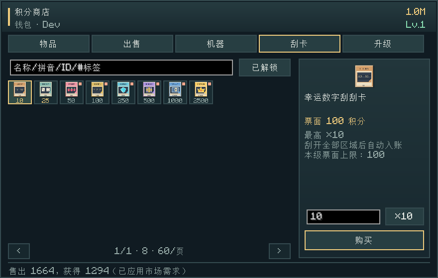

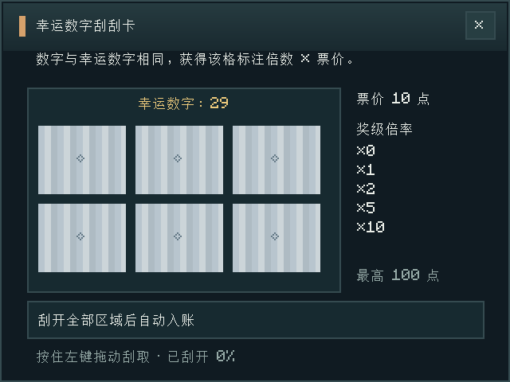

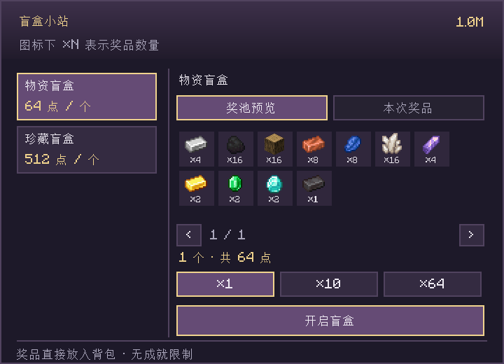

批量开启按单盒价格与数量扣款，并发放实际抽取的奖品。超出背包容量的奖品保存至购买者的「待领取」列表，可通过「领取待领」按钮或 `/teamecon claimboxes` 领取。待领奖品随存档保存，全部领取后可开启下一批。

### 无线终端

**无线终端**提供便携式商店、回收、升级、小游戏和购卡入口，使用权限由设备等级决定。盲盒通过独立盲盒机开启。

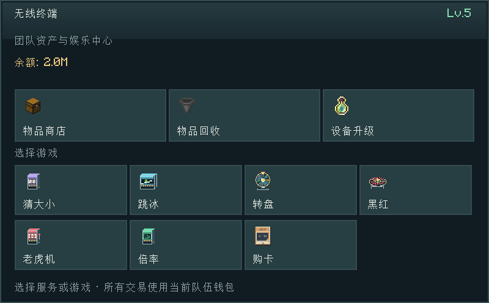

### 游戏内指南

安装 **Patchouli** 后可使用游戏内指南书，内容包括开局流程、经济系统、设备操作、奖励概率、盲盒、组队与合成配方。界面和指南均支持简体中文、繁体中文及英文。

指南书首次进入世界时赠送，也可用 **书＋铁锭** 无序合成。未安装 Patchouli 的环境可查阅[网页版指南](docs/试玩指南.md#handbook)；Forge 1.21.1 暂无对应的 Patchouli 版本。

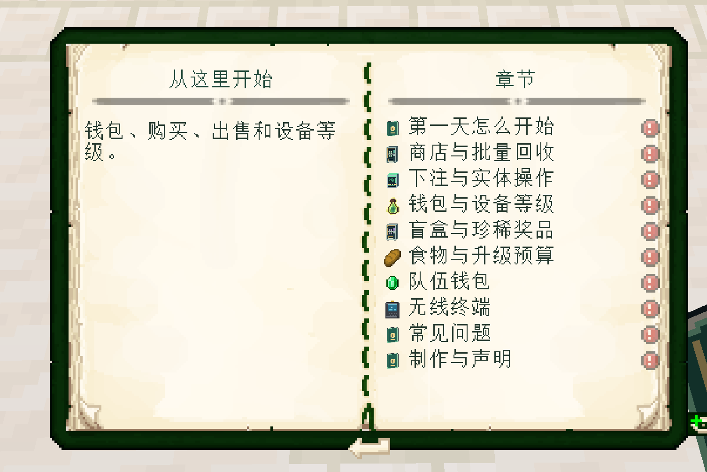

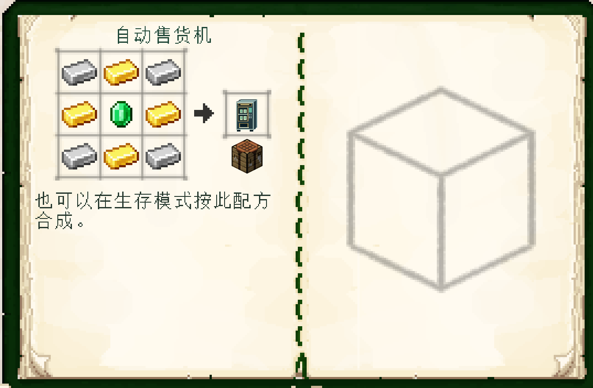

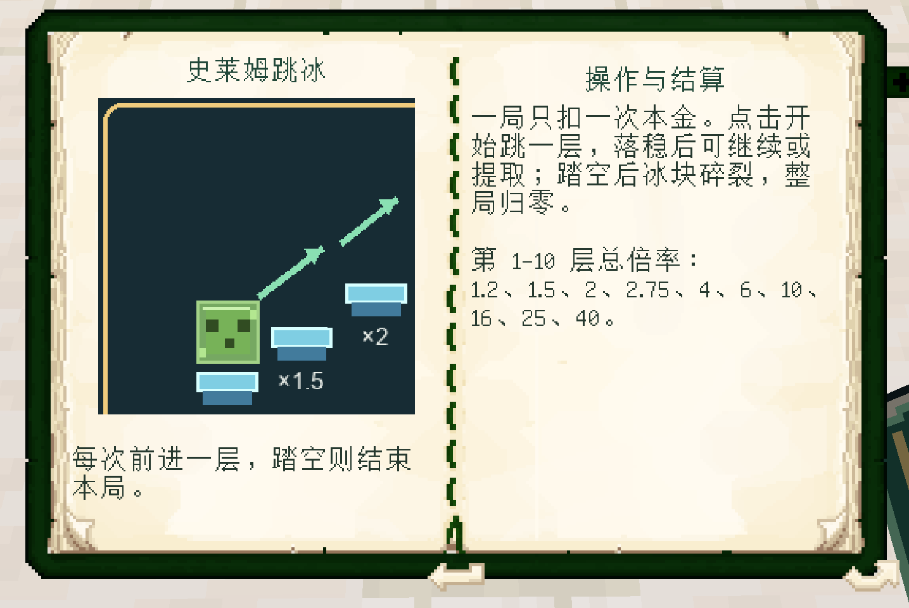

<a id="installation"></a>

## 下载与安装

从 [Releases](https://github.com/Evoltsuki/Team_Economy/releases) 下载与 Minecraft 版本和加载器对应的 JAR，放入实例的 `mods/` 目录。每个实例仅安装一个对应版本；多人游戏的客户端与服务端须使用相同的 Minecraft 版本、加载器和模组文件。

下表列出 **1.0.1 的支持版本与文件名**。

| Minecraft | 加载器版本 | Java | 安装文件 |
|---|---|---|---|
| 1.21.1 | NeoForge 21.1.1+ | 21 | `teamecon-neoforge-1.21.1-1.0.1.jar` |
| 1.21 | NeoForge 21.0.143+ | 21 | `teamecon-neoforge-1.21-1.0.1.jar` |
| 1.20.1 | Forge 47.4.10 | 17 | `teamecon-forge-1.20.1-1.0.1.jar` |
| 1.21.1 | Forge 52.1.0 | 21 | `teamecon-forge-1.21.1-1.0.1.jar` |

NeoForge 列出对应 Minecraft 分支的最低正式版本；可选联动模组还需满足各自的依赖要求。

进入世界后使用 `/teamecon shop` 打开积分商店。更新模组前需备份存档与配置，并移除旧版 JAR。

<a id="commands"></a>
<a id="常用指令与快速试玩"></a>

## 常用指令

### 普通玩家指令

普通玩家可使用以下指令。`<参数>` 为必填项，输入时以实际值替换。

| 指令 | 用途 |
|---|---|
| `/teamecon` | 查看简要帮助 |
| `/teamecon shop` | 打开积分商店，进行采购、回收和升级 |
| `/teamecon claimboxes` | 将待领取的盲盒奖品放入背包，不额外收费 |
| `/teamecon balance` | 查看当前个人／队伍钱包余额 |
| `/teamecon price <物品ID>` | 查询物品估价，例如 `/teamecon price minecraft:diamond`；实际回收收入按市场需求调整 |
| `/teamecon sell` | **立即出售主手整叠物品**；需要先核对报价时，请使用商店的「出售」页 |
| `/teamecon buy <物品ID> <数量>` | 购买指定数量，例如 `/teamecon buy minecraft:bread 16`；需满足余额、背包空间和购买条件 |

### 管理指令

以下指令需要 **OP 2 级或以上权限**，单人世界可开启作弊使用。`[玩家]` 表示可选的在线玩家名，省略时作用于自己；服务器控制台使用这些带目标的指令时需填写玩家名。

| 指令 | 用途 |
|---|---|
| `/teamecon admin kit` | 给予自己六种游戏机、自动售货机和盲盒机；`admin machine` 是同义指令 |
| `/teamecon admin balance <点数>` | 将自己的当前钱包余额设置为指定点数 |
| `/teamecon admin unlock [玩家]` | 将目标玩家当前钱包设为 Lv.5，并豁免该玩家在团队经济中的进度门槛 |
| `/teamecon admin level <等级> [玩家]` | 设置目标玩家当前钱包等级，等级范围为 1–5；保留个人豁免状态 |
| `/teamecon admin bypass <true/false> [玩家]` | 用 `true` 开启、`false` 关闭个人进度豁免；钱包等级不变 |
| `/teamecon admin status [玩家]` | 查看目标玩家当前钱包的等级、余额和个人进度豁免状态 |
| `/teamecon admin boxes` | 管理箱种、价格、奖品、数量与中奖百分比 |
| `/teamecon admin prices` | 打开物品定价面板；手持物品时直接选中该物品 |
| `/teamecon reward <奖励ID> <点数> [玩家]` | 向目标玩家当前个人／团队钱包发放一次任务奖励 |
| `/teamecon_quest_reward <FTB奖励ID> <点数> [玩家]` | 按 FTB 奖励 ID 发放一次团队积分 |
| `/teamecon admin reload` | 重载本模组 JSON 配置 |

进度豁免仅作用于团队经济的购买与使用条件，按玩家保存，不修改原版进度。钱包等级和余额属于当前个人或团队钱包，对团队钱包的修改影响全队。豁免期间的交易遵循服务器定价及禁售规则。`/teamecon admin advancements [玩家]` 是启用进度豁免的同义指令。

## 服主配置

### 物品定价

`/teamecon admin prices` 打开物品定价面板，采用创造模式物品栏的分类标签与物品网格。点击图标选择定价对象；搜索覆盖全部物品，支持中文名、物品 ID、全拼和拼音首字母，例如 `金锭`、`jinding`、`jd`。

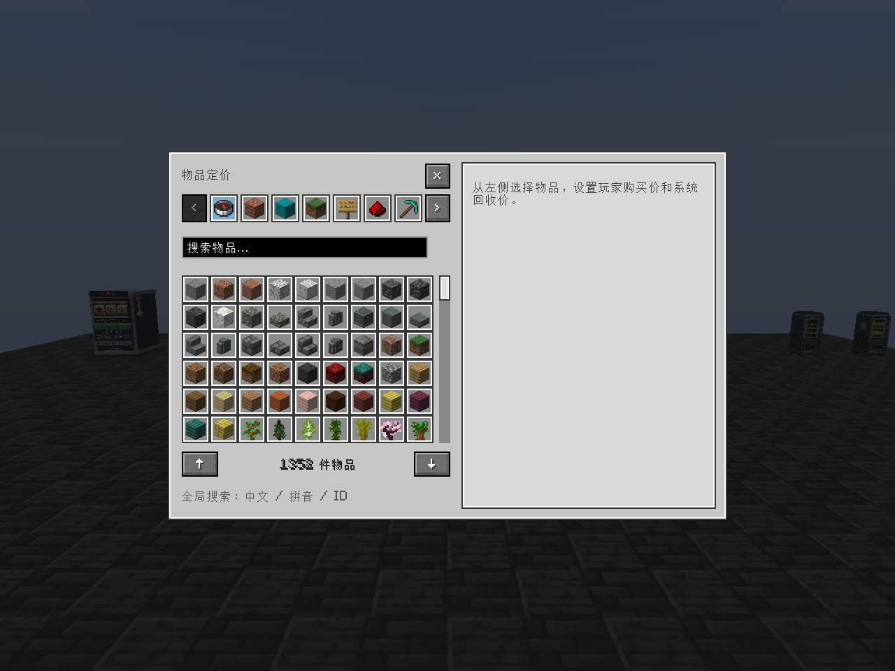

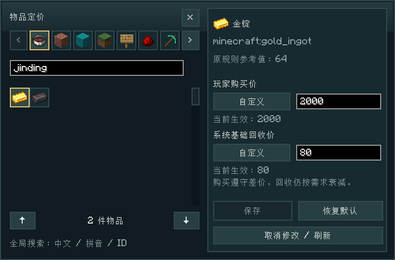

玩家购买价与系统基础回收价可分别设为「沿用默认」「关闭」或「自定义」。配置保存至 `config/teamecon_price_overrides.json` 并立即生效；恢复默认时移除该物品的自定义设置。购买价受差价下限与设备底价约束，实际回收收入受市场需求影响，交易需满足进度要求。图示价格为自定义配置。

第三方模组物品需设置回收价后启用回收，支持默认状态物品；带额外数据或储存内容的变体不在回收范围内。完整规则见[定价配置](docs/server-configuration.md)。

### 盲盒管理

`/teamecon admin boxes` 打开容器式盲盒管理面板，支持新增、编辑与删除箱种，设置名称、单盒价格、启用状态和可选阶段。

面板上方为奖品样板栏，下方为玩家背包。拖放或 Shift 点击背包物品可添加样板，拖动可调整位置，右键可移除；样板不消耗原物，空格不参与抽奖。安装对应版本的 **JEI** 后，右侧显示 JEI 物品列表，可直接拖入奖品格，无需开启作弊取物。未安装 JEI 时仍可使用背包物品。 鼠标悬停背包或 JEI 物品可查看详细信息。

选中样板后可设置数量与中奖百分比，范围为 `0–100`，最多六位小数。修改某项后，该项保持输入的比例，其余奖品按原比例自动分配剩余概率；例如 `50%、30%、20%` 中将第一项改为 `60%`，其余两项变为 `24%、16%`。新增奖品自动获得 `100 ÷ 新奖品总数` 的百分比，移除奖品后自动重新分配；总和保持 **100%**。只有一个奖品时概率为 **100%**，`0%` 奖品不参与抽取。

奖品支持普通物品、原版刷怪蛋（包括尸壳）及指定效果的药水；模组物品需开启该箱种的「模组物品」选项。背包样板不支持改名、附魔或容器内容等额外数据，提示会说明具体原因。箱种列表与盲盒机使用相同的本地化名称，也可自行命名。

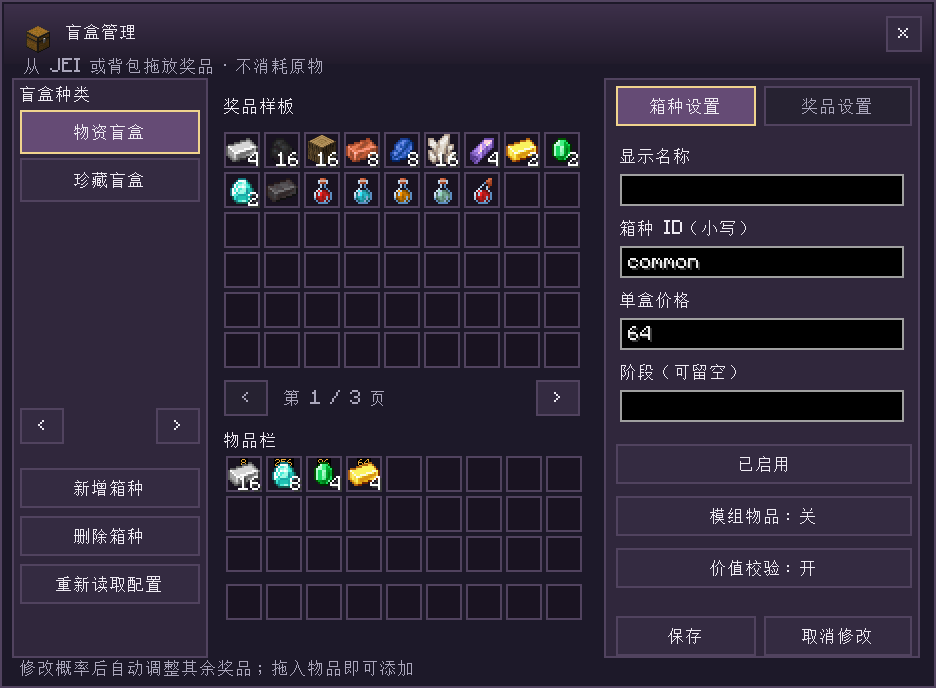

配置保存至 `config/teamecon_blindbox.json` 并立即生效，保存时保留备份。每个箱种可独立设置第三方物品与价值校验开关。完整字段见[盲盒配置](docs/server-configuration.md)。

### 任务奖励接口

主模组提供任务奖励命令，可接入 FTB Quests 等任务系统。FTB Quests 命令奖励示例：

```text
teamecon reward yourpack:chapter1/start 100
```

以领取玩家作为执行实体，权限等级设置为 **2**，团队奖励设为 **true**。命令向当前个人／团队钱包追加积分；同一奖励 ID 对同一钱包只发放一次，领取记录随存档保存。控制台调用时在末尾填写在线玩家名。点数范围为 1～1,000,000,000；奖励 ID 应包含整合包自己的命名空间。

兼容命令 `teamecon_quest_reward 7445429B27FE4CD5 25` 使用 FTB 奖励 ID 发放点数。任务内容、奖励 ID 和金额由任务配置定义；命令规范与 Java API 见[任务奖励接入文档](docs/quest-rewards.md)。

### 交易范围

系统商店默认提供原版物品和原版附魔书。服主可通过商店目录添加已安装的第三方模组物品，通过定价面板开启回收，或将物品加入盲盒奖池。第三方附魔暂不售卖；本模组设备、终端和票卡通过专用目录获取，不支持回收。

部分商品要求购买玩家完成原版进度，鞘翅、下界之星等关键战利品默认禁止购买。商店由服务器统一管理，不提供玩家自行上架、定价和补货的店铺功能。价格、需求和设备规则见[平衡配置指南](docs/平衡配置指南.md)。

<a id="feedback"></a>

## 文档与反馈

| 内容 | 文档 |
|---|---|
| 安装、玩法、组队与合成配方 | [玩法指南](docs/试玩指南.md) |
| 服主调价、进度规则与配置 | [平衡配置指南](docs/平衡配置指南.md) |
| 自行构建 JAR 和准备发布附件 | [手动打包指南](docs/手动打包指南.md) |

发现问题请在仓库 **Issues** 按[反馈模板](.github/ISSUE_TEMPLATE/bug_report.md)提供游戏、加载器与模组版本，单人／服务端环境，复现步骤，预期与实际结果，并附相关日志或截图。整合包反馈请一并说明模组列表。

## 制作与许可

**作者：洁柔厨。** 代码、文档与部分美术使用 AI 辅助。感谢 Forge、NeoForge、FTB Teams、FTB Library、Architectury 与 Patchouli 的开发者；完整署名和材料说明见 [CREDITS.md](CREDITS.md)、[NOTICE.md](NOTICE.md)。

本项目采用 **[MIT 开源许可](LICENSE)**，允许使用、修改、商业使用和再分发，须保留版权及许可声明。第三方材料仍遵循各自许可，见 [NOTICE.md](NOTICE.md)。点数仅用于游戏内玩法，没有现实货币价值。

非官方 Minecraft 项目，与 Mojang、Microsoft 无隶属关系。

<details>
<summary><strong>从源码构建</strong></summary>

默认构建 **NeoForge 1.21.1**，需要 **JDK 21**。Windows 双击 `build-mod.bat`，或在项目根目录运行：

```powershell
.\build-mod.bat
```

Linux／macOS：

```bash
bash ./gradlew releaseMod
```

首次构建需要网络连接；依赖已缓存时可添加 `--offline`。`releaseMod` 将 JAR 与校验值输出至 `dist/`，普通 Gradle `build` 输出至 `build/libs/`。

准备 GitHub Release 附件：

```powershell
py -3.12 tools/package_release.py --offline
```

Python 依赖及联网打包方法见[手动打包指南](docs/手动打包指南.md)。完整打包另需 JDK 17（Forge 1.20.1）及 Python 3.11+；四个目标的命令见打包指南。`release/1.0.1/` 包含四份玩家 JAR、`CHANGELOG.md` 和 `SHA256SUMS.txt`。

</details>

<details>
<summary><strong>项目目录与文件用途</strong></summary>

| 文件夹 | 作用 |
|---|---|
| `src/main/java/` | 模组逻辑、界面、网络与服务端实现 |
| `src/main/resources/` | 纹理、模型、语言、配方及游戏内图文指南 |
| `src/main/templates/` | 构建时填入版本和作者信息的模组元数据模板 |
| `versions/forge/` | Forge 构建入口，共享业务源码转换及 1.20.1 / 1.21.1 平台适配层 |
| `src/generated/` | 按需生成的数据文件 |
| `docs/` | 玩家指南、服主配置、开发接入与打包说明 |
| `docs/images/`、`docs/images/screenshots/` | 截图来源清单与实机界面、玩法图 |
| `tools/` | 资源生成、校验和打包脚本；逐项用途见 [tools/README.md](tools/README.md) |
| `gradle/`、`gradle/wrapper/` | 固定 Gradle 版本的启动器，源码构建必需 |
| `.github/` | 自动构建、凭据检查工作流和问题反馈模板 |
| `.githooks/` | 提交前扫描暂存区，阻止已知凭据进入提交 |
| `dist/` | 本地构建得到的玩家 JAR 与校验值 |
| `release/`、`release/1.0.1/` | 按版本存放四份玩家 JAR、更新日志与 SHA-256 校验清单 |
| `build/` | 本地构建输出与临时文件 |
| `.gradle/` | Gradle 构建缓存 |
| `logs/` | 本地运行日志 |
| `run/` | 开发环境的游戏配置与存档 |

根目录的 Gradle 文件、Wrapper 和 `build-mod.bat` 用于构建；`requirements.txt` 列出 Python 工具依赖。`README.md`、`README_EN.md`、许可及署名文件为公开项目说明。

`dist/`、`release/`、`build/`、`.gradle/`、`logs/` 和 `run/` 由本地构建或运行生成，不包含在源码仓库中。

</details>
