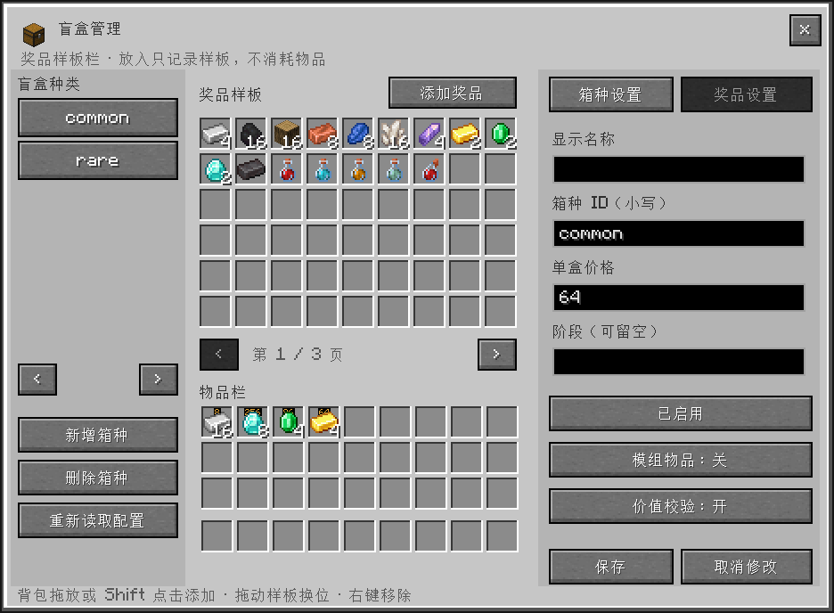
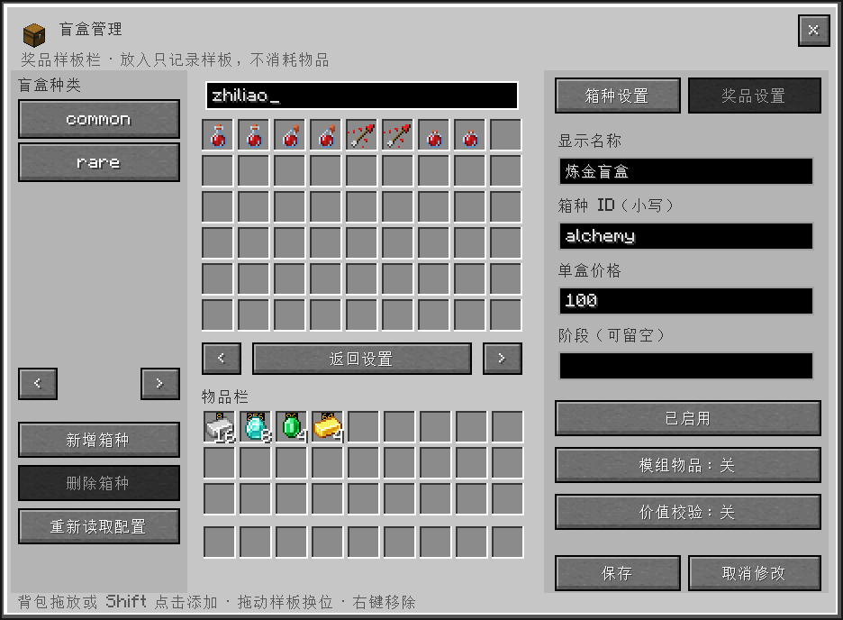

# Team Economy · 团队经济/梭哈吧，史蒂夫

[English README](README_EN.md)

当前源码为 **1.0.1 待发布版本**，下文包含尚未发布的改动；目前公开下载为 **1.0.0**。

[下载 1.0.0](https://github.com/Evoltsuki/Team_Economy/releases/tag/v1.0.0) · [源码仓库](https://github.com/Evoltsuki/Team_Economy) · [更新日志](CHANGELOG.md) · [问题反馈](https://github.com/Evoltsuki/Team_Economy/issues)

  

**把仓库里的余料换成点数，在基地开一间小队游戏厅。**

Team Economy 为 Minecraft 生存加入物资回收、积分商店和六种实体小游戏。挖矿、种田后，把暂时用不到的材料卖给系统商店，攒钱购买补给、解锁机器；装上 FTB Teams，还能与队友共用钱包和设备等级。

*A survival economy mod with material recycling, shared team wallets, and six playable game machines. Available for Minecraft 1.20.1, 1.21 and 1.21.1 on Forge / NeoForge; see the version table below.*

[下载与安装](#installation) · [图文试玩指南](docs/试玩指南.md) · [服主配置](docs/平衡配置指南.md) · [常用指令](#常用指令与快速试玩) · [反馈问题](#feedback)


## 从仓库到游戏厅

### 回收余料，买点需要的东西

自动售货机与 `/teamecon shop` 会记住每位玩家上次使用的页签，重新打开或重启游戏后自动恢复；首次使用进入「商品」页。偏好保存在本机客户端，各玩家独立。「出售」页提供 **27 格待售区**：放入材料、查看整批报价、确认出售。点数直接记入钱包，可以购买原版物品与附魔书。找商品时，可使用分类、名称、全拼、拼音首字母、物品 ID 或 `#标签` 搜索，例如 `jinding` 或 `jd` 查找金锭。

同类材料卖得越多，回收需求越低；采购价与回收价分别计算。默认保留生存进度门槛，让商店用于补充物资，也让采集与探索继续有用。


### 小队一起攒，设备一起解锁

安装 **FTB Teams** 后，同队成员共享点数和**五级设备权限**。回收收入进入同一个钱包，购物、升级和游戏也从中扣款。屏幕右侧可查看队伍余额与成员净收支。

单独安装 Team Economy 即可玩个人经济和全部小游戏。队伍等级用于设备解锁；购买商品所需的原版进度仍按操作玩家检查。


### 把游戏摆进世界里

放好机器，站到正面，直接右键机身按钮选择玩法、调整金额和开始一局。

| 游戏 | 默认解锁 | 玩法 |
|---|---|---|
| 猜大小机 | Lv.1 | 选大或小，等待 1–10 的数字揭晓 |
| 史莱姆跳冰 | Lv.2 | 跳向下一块冰，成功后决定继续还是提取 |
| 幸运转盘 | Lv.3 | 转动彩色轮盘，按指针落点结算 |
| 黑红轮盘 | Lv.4 | 选红、黑或单号，等待轮盘停下 |
| 老虎机 | Lv.5 | 看三轴停稳，按图案组合结算 |
| 倍率竞猜 | Lv.5 | 在倍率上涨时选择提取，崩盘则本局归零 |

同一玩家可以让多台实体机器同时运行，每台独立计时、操作和结算；无线终端也有独立的一局。同一台机器仍由当前操作者使用，结束后才能换人。每局先扣款，结算回原出资钱包，离线或机器卸载不会丢失待结算记录。

升级解锁使用权限，机器另行合成或购买。持续回收物资就能积攒升级费，小游戏的输赢由每局结果决定。


### 刮张卡，看看盲盒里有什么

**八种实体刮刮卡**从幸运数字到皇冠大奖逐级开放：主手持卡，左键打开，拖动刮开后自动结算。**独立盲盒机**提供奖池预览，可开 1／10／64 盒并查看本次奖品。奖品格右上角显示概率，下方「×N」表示数量。奖池包含治疗、抗火、水肺等药水，以及喷溅和滞留药水。


一次可开 1／10／64 盒，按实际结果扣费和发放。背包装不下的奖品按购买者保存到「待领取」，退出游戏后仍保留；清出空间后点击「领取待领」，或执行 `/teamecon claimboxes`。领完上批奖品后可继续开盒。

后期可兑换**无线终端**，随身使用商店、回收、升级、小游戏和购卡功能。游戏界面与 Patchouli 图文指南支持简体中文、繁体中文和英文。

商店、盲盒与终端采用居中紧凑窗口，即使 GUI 缩放设为「自动」也会保留四周留白。黑红轮盘采用低台，下注点数显示在后方标题下，方便站在正面观察轮面。

### 把玩法和配方带在身边

安装 **Patchouli** 后，右键打开随开局赠送的指南书。从目录进入开局、经济、设备、盲盒和组队条目；机器介绍按 **如何获取 → 怎样操作 → 奖励与概率 → 合成配方** 阅读。概率页说明中奖条件与单次概率，配方页直接展示工作台摆放方式。

指南可用 **书＋铁锭** 无序合成。没有 Patchouli，或使用暂时没有匹配版本的 Forge 1.21.1，也可以阅读同样覆盖全部玩法的[网页版指南](docs/试玩指南.md#handbook)。


<a id="installation"></a>

## 下载与安装

在本仓库 **Releases** 按下表选择一份 JAR，放入实例的 `mods/`。多人服的客户端和服务端必须使用相同加载器、游戏版本与模组文件。不要同时安装多个目标包。

| Minecraft | 加载器版本 | Java | 安装文件 |
|---|---|---|---|
| 1.21.1 | NeoForge 21.1.1+ | 21 | `teamecon-neoforge-1.21.1-1.0.1.jar` |
| 1.21 | NeoForge 21.0.143+ | 21 | `teamecon-neoforge-1.21-1.0.1.jar` |
| 1.20.1 | Forge 47.4.10 | 17 | `teamecon-forge-1.20.1-1.0.1.jar` |
| 1.21.1 | Forge 52.1.0 | 21 | `teamecon-forge-1.21.1-1.0.1.jar` |

NeoForge 列出对应 Minecraft 分支的最低正式版本；可选联动模组还需满足各自的依赖要求。

进入世界后输入 `/teamecon shop`，即可打开积分商店。首次进入赠送指南书，也能用**书＋铁锭**无序合成；装有 Patchouli 时手持右键阅读。完整操作也可直接查看[网页版指南](docs/试玩指南.md)。更换模组文件前，请备份存档和配置，并移走原 JAR。

## 常用指令与快速试玩

### 普通玩家指令

以下指令不需要 OP 权限。聊天栏输入指令后按回车执行；`<物品ID>`、`<数量>` 表示需要替换的参数，不用输入尖括号。

| 指令 | 用途 |
|---|---|
| `/teamecon` | 查看简要帮助 |
| `/teamecon shop` | 打开积分商店，进行采购、回收和升级 |
| `/teamecon claimboxes` | 将待领取的盲盒奖品放入背包，不额外收费 |
| `/teamecon balance` | 查看当前个人／队伍钱包余额 |
| `/teamecon price <物品ID>` | 查询物品估价，例如 `/teamecon price minecraft:diamond`；实际回收收入还受市场需求影响 |
| `/teamecon sell` | **立即出售主手整叠物品**；需要先核对报价时，请使用商店的「出售」页 |
| `/teamecon buy <物品ID> <数量>` | 购买指定数量，例如 `/teamecon buy minecraft:bread 16`；仍检查资金、背包空间和购买门槛 |

### 管理指令

以下指令需要 **OP 2 级或以上权限**，单人世界可开启作弊使用。`[玩家]` 表示可选的在线玩家名，省略时作用于自己；服务器控制台使用这些带目标的指令时需填写玩家名。

| 指令 | 用途 |
|---|---|
| `/teamecon admin kit` | 给予自己六种游戏机、自动售货机和盲盒机；`admin machine` 是同义指令 |
| `/teamecon admin balance <点数>` | **设置**自己当前钱包的余额，例如 `1000000`，不是在原余额上增加 |
| `/teamecon admin unlock [玩家]` | 将目标玩家当前钱包设为 Lv.5，并豁免该玩家在团队经济中的进度门槛 |
| `/teamecon admin level <等级> [玩家]` | 设置目标玩家当前钱包等级，等级范围为 1–5；保留个人豁免状态 |
| `/teamecon admin bypass <true/false> [玩家]` | 用 `true` 开启、`false` 关闭个人进度豁免；钱包等级不变 |
| `/teamecon admin status [玩家]` | 查看目标玩家当前钱包的等级、余额和个人进度豁免状态 |
| `/teamecon admin boxes` | 管理箱种、价格、奖品、数量与权重 |
| `/teamecon admin prices` | 打开物品定价面板；手持物品时直接选中该物品 |
| `/teamecon reward <奖励ID> <点数> [玩家]` | 为目标玩家当前团队钱包发放一次任务奖励 |
| `/teamecon_quest_reward <FTB奖励ID> <点数> [玩家]` | 按 FTB 奖励 ID 发放一次团队积分 |
| `/teamecon admin reload` | 重载本模组 JSON 配置 |

**进度豁免仅作用于团队经济，原版进度保持不变。** 豁免按玩家保存，重登后仍有效，不自动扩散给队友；钱包等级与余额则由当前个人／队伍钱包决定，在队伍中修改会影响共享钱包。购买仍收费，禁售物品与交易范围仍按服务器规则处理。`/teamecon admin advancements [玩家]` 与 `bypass true` 作用相同。

想直接体验全部机器，可在允许作弊的世界依次输入：

```text
/teamecon admin kit
/teamecon admin unlock
/teamecon admin balance 1000000
/teamecon shop
```

这会给予机器、解锁本模组的等级与进度门槛，并将当前钱包设为 1,000,000 点。若要重新体验正常的等级与进度限制，依次输入：

```text
/teamecon admin bypass false
/teamecon admin level 1
```

这两条指令恢复门槛与 Lv.1，保留当前余额、物品和已获得的原版进度。

## 服主定价与任务奖励

使用 `/teamecon admin prices` 打开创造物品栏式的定价面板：分类标签、物品网格、滚动条，点击物品图标即可编辑，不会取出物品。搜索支持中文名、物品 ID、全拼和拼音首字母，例如 `金锭`、`jinding`、`jd`。输入搜索词时查找全部物品。


截图中的购买价 2,000、回收基础价 80 是服主自定义示例。

玩家购买价与系统基础回收价分别设置，可选择「沿用默认」「关闭」「自定义」。保存后立即生效，恢复默认会移除该物品的面板覆盖。面板配置保存在 `config/teamecon_price_overrides.json`，只记录改过的物品；购买差价、设备底价与进度要求继续适用，回收仍计算市场需求。第三方物品须明确填写回收价才能回收，仅接受默认状态物品，不回收带额外数据或储存内容的变体。详细规则见[定价配置](docs/server-configuration.md)。

### 盲盒管理

使用 `/teamecon admin boxes`（OP 2）打开容器式盲盒管理面板。上方是奖品样板栏，下方是自己的背包：拖放物品或 Shift 点击背包物品即可添加奖品，拖动样板可换位，右键移除。样板不消耗背包原物，空格不计入抽奖。选中奖品后，在右侧调整数量与权重并查看概率；「箱种设置」可新增箱种、修改名称、价格、启用状态和可选阶段。

没有准备好的物品时，可以通过「添加奖品」搜索，支持中文、全拼、首字母、物品 ID 和药水 ID。支持普通物品及具体药水效果；带改名、附魔或容器内容等额外数据的背包样本会明确提示不支持。





点击「保存」应用到 `config/teamecon_blindbox.json`；删除箱种需要再次确认。面板支持第三方物品开关和价值校验开关，保存会保留备份。图中炼金盲盒为自定义示例；完整字段见[服主配置](docs/server-configuration.md)。

### 任务奖励接口

任务作者可使用主模组自带的奖励命令，无需任务奖励附属模组。例如在 FTB Quests 的命令奖励中填写：

```text
teamecon reward yourpack:chapter1/start 100
```

以领取玩家作为执行实体，权限等级设置为 **2**，团队奖励设为 **true**。命令向当前个人／团队钱包追加积分；同一奖励 ID 对同一钱包只发放一次，领取记录随存档保存。控制台调用时在末尾填写在线玩家名。点数范围为 1～1,000,000,000；奖励 ID 应包含整合包自己的命名空间。

也支持 `teamecon_quest_reward 7445429B27FE4CD5 25`。任务内容、奖励 ID 和金额由任务配置维护，主模组提供发放接口。完整的命令示例、失败处理和 Java API 见[任务奖励接入文档](docs/quest-rewards.md)。

## 安装前常见问题

**这是哪一种经济模组？** 点数记录在个人或 FTB 队伍钱包中，主要通过回收物资获得，用于系统商店和小游戏。商店按服务器规则报价；当前没有玩家自行上架、定价、补货的摆摊功能。

**支持哪些物品和加载器？** 默认买卖支持原版物品与原版附魔；服主可在独立商店目录中上架第三方模组物品，也可将其设为盲盒奖品，第三方物品可在定价面板中逐项开启回收，第三方附魔暂不售卖；本模组设备、终端和票卡使用专用目录获取，不能回收。支持的加载器和游戏版本见上方安装表。

**有点数就能买到所有东西吗？** 部分商品要求玩家完成对应原版进度；鞘翅、下界之星等关键战利品默认禁购。加入队伍不会替代个人进度，也不会合并原有个人余额。

**可以放进整合包吗？** 可以。MIT 许可允许整合包收录、修改和商业使用，分发时须保留版权及许可声明，详情见 [LICENSE](LICENSE)。服主可按[平衡配置指南](docs/平衡配置指南.md)调整价格、需求和设备规则；[商店与盲盒配置示例](docs/server-configuration.md)说明如何自定义商品、价格、奖品数量与权重。

<a id="feedback"></a>

## 文档与反馈

| 想了解什么 | 从这里开始 |
|---|---|
| 安装、第一局、组队、全部配方 | [图文试玩指南](docs/试玩指南.md) |
| 服主调价、进度规则与配置 | [平衡配置指南](docs/平衡配置指南.md) |
| 自行构建 JAR 和准备发布附件 | [手动打包指南](docs/手动打包指南.md) |

发现问题请在仓库 **Issues** 按[反馈模板](.github/ISSUE_TEMPLATE/bug_report.md)提供游戏、加载器与模组版本，单人／服务端环境，复现步骤，预期与实际结果，并附相关日志或截图。整合包反馈请一并说明模组列表。

## 制作与许可

**作者：洁柔厨。** 代码、文档与部分美术使用 AI 辅助。感谢 Forge、NeoForge、FTB Teams、FTB Library、Architectury 与 Patchouli 的开发者；完整署名和材料说明见 [CREDITS.md](CREDITS.md)、[NOTICE.md](NOTICE.md)。

本项目采用 **[MIT 开源许可](LICENSE)**，允许使用、修改、商业使用和再分发，须保留版权及许可声明。第三方材料仍遵循各自许可，见 [NOTICE.md](NOTICE.md)。点数仅用于游戏内玩法，没有现实货币价值。

非官方 Minecraft 项目，与 Mojang、Microsoft 无隶属关系。

<details>
<summary><strong>从源码构建</strong></summary>

默认构建 **NeoForge 1.21.1**，需要 **JDK 21**。Windows 双击 `build-mod.bat`，或在项目根目录运行：

```powershell
.\build-mod.bat
```

Linux／macOS：

```bash
bash ./gradlew releaseMod
```

首次构建需要联网；已有完整依赖缓存时可加 `--offline`。通过检查后，JAR 和校验值输出到 **`dist/`**；普通 Gradle `build` 输出到 `build/libs/`。资源已随源码提供，NeoForge 单独构建无需 Python，也不会启动游戏。

准备 GitHub Release 附件：

```powershell
py -3.12 tools/package_release.py --offline
```

根目录 `README.md` 为 GitHub 中文首页，`README_EN.md` 为独立英文版；两份文件分别维护。源码可从 [GitHub 仓库](https://github.com/Evoltsuki/Team_Economy)获取。

Python 依赖及联网打包方法见[手动打包指南](docs/手动打包指南.md)。完整打包另需 JDK 17（Forge 1.20.1）及 Python 3.11+；四个目标的命令见打包指南。`release/1.0.1/` 包含四份玩家 JAR、`CHANGELOG.md` 和 `SHA256SUMS.txt`。

**版本固定为 1.0.1。后续仅在作者明确要求时修改 `gradle.properties`；构建与打包不自动递增版本。**

</details>

<details>
<summary><strong>项目目录与文件用途</strong></summary>

| 文件夹 | 作用 |
|---|---|
| `src/main/java/` | 模组逻辑、界面、网络与服务端实现 |
| `src/main/resources/` | 纹理、模型、语言、配方及游戏内图文指南 |
| `src/main/templates/` | 构建时填入版本和作者信息的模组元数据模板 |
| `versions/forge/` | Forge 构建入口，共享业务源码转换及 1.20.1 / 1.21.1 平台适配层 |
| `src/generated/` | 按需生成的数据文件 |
| `docs/` | 玩家指南、服主配置、打包说明和论坛发布稿 |
| `docs/images/`、`docs/images/screenshots/` | 截图来源清单与 1.0.0 实机原图 |
| `tools/` | 资源生成、校验和打包脚本；逐项用途见 [tools/README.md](tools/README.md) |
| `gradle/`、`gradle/wrapper/` | 固定 Gradle 版本的启动器，源码构建必需 |
| `.github/` | 自动构建、凭据检查工作流和问题反馈模板 |
| `.githooks/` | 提交前扫描暂存区，阻止已知凭据进入提交 |
| `dist/` | 本地构建得到的玩家 JAR 与校验值 |
| `release/`、`release/1.0.1/` | 按版本存放四份玩家 JAR、更新日志与 SHA-256 校验清单 |
| `build/` | 本地构建输出与临时文件 |
| `.gradle/` | Gradle 构建缓存 |
| `logs/` | 本地运行日志 |
| `run/` | 本地开发游戏的配置与存档，清理工作区时保留 |

根目录的 Gradle 文件、Wrapper 和 `build-mod.bat` 用于构建；`requirements.txt` 列出 Python 工具依赖。`README.md`、`README_EN.md`、许可及署名文件为公开项目说明。

`dist/`、`release/`、`build/`、`.gradle/`、`logs/`、`run/`、`internal/` 以及本地任务文件 `PROGRESS.md`、`待办事项.txt` 不提交仓库。下载的干净源码中可能没有这些本地目录。

</details>
