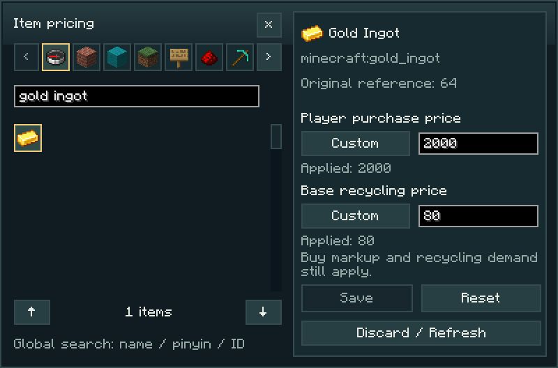
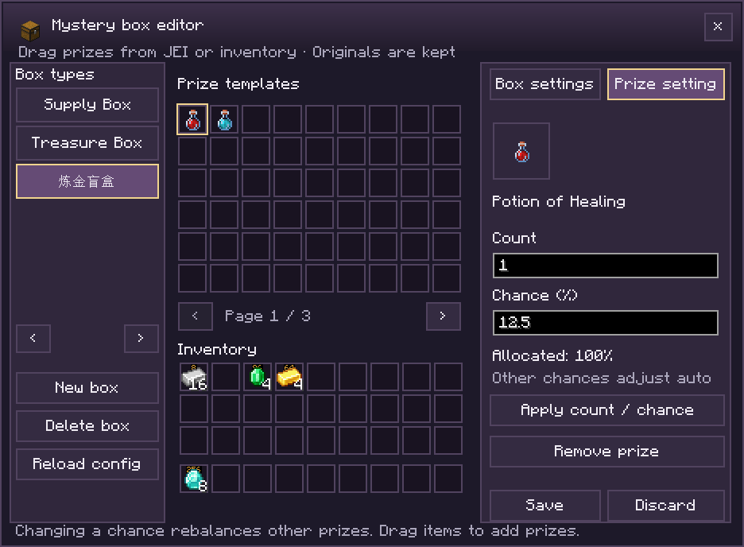

# Team Economy

[简体中文](README.md)

Current release: **1.0.2**.

[Download 1.0.2](https://github.com/Evoltsuki/Team_Economy/releases/tag/v1.0.2) · [Source code](https://github.com/Evoltsuki/Team_Economy) · [Changelog](CHANGELOG.md) · [Report an issue](https://github.com/Evoltsuki/Team_Economy/issues)

  

Team Economy is a survival economy and minigame mod for Minecraft. It provides material recycling, a points shop and six physical game machines. Points earned from recycling can fund supplies, equipment upgrades and games. Optional FTB Teams integration adds shared wallets and equipment levels.

[Installation](#installation) · [Gameplay guide (Chinese)](docs/试玩指南.md) · [Commands](#commands) · [Configuration](#configuration) · [Building from source](#building-from-source)


## Features

### Recycling and the points shop

Vending Machines and `/teamecon shop` provide purchases, recycling and level upgrades. The **Sell** tab includes a **27-slot staging area** for batch quotes and confirmed sales. Income is credited to the current wallet. The catalogue supports category filters and searches by name, full Chinese pinyin, pinyin initials, item ID and `#tag`; `jinding` or `jd` matches 金锭 (gold ingot).

The shop saves each player’s last tab locally and restores it across game restarts. The first visit opens **Items**.

Purchase and recycling prices are calculated separately. Repeated sales of the same material reduce market demand and its recycling value. Some purchases require specific vanilla advancements.


### Team wallets and equipment levels

With **FTB Teams**, teammates share their points and **five equipment levels**. Recycling income, purchases, upgrades and games all use the team wallet. The sidebar shows the team balance and members' net contributions.

Personal wallets and all six games are available without FTB Teams. Equipment access depends on wallet level; purchase advancements apply to the individual player. Personal and team balances are stored separately.


### Physical game machines

Each game operates through buttons on a placed machine. Right-click the controls to select an option, set the stake and start a round.

| Game | Default unlock | How to play |
|---|---|---|
| High / Low Machine | Lv.1 | Choose low or high, then reveal a number from 1 to 10 |
| Slime Ice Hop Machine | Lv.2 | Jump to the next ice block; after a successful jump, continue or cash out |
| Lucky Wheel | Lv.3 | Spin the colored wheel and receive the payout for the selected segment |
| Red & Black Roulette | Lv.4 | Choose red, black or a single number and wait for the wheel to stop |
| Slot Machine | Lv.5 | Match symbols on three reels to receive a payout |
| Multiplier Machine | Lv.5 | Cash out while the multiplier rises; a crash ends the round with no payout |

A player can operate several machines simultaneously, with independent rounds, controls and settlement. The Wireless Terminal uses a separate round. Each machine is reserved for its operator until the round ends. Stakes are charged at the start, payouts return to the funding wallet, and pending settlements are stored with the world.

Equipment levels determine access to machines, which are acquired through crafting or purchase. The [gameplay guide](docs/试玩指南.md) covers controls, probabilities and recipes.


### Scratch tickets and mystery boxes

**Eight physical scratch-ticket types**, from Lucky Numbers to Crown Jackpot, are unlocked by equipment level. Hold a purchased ticket in your main hand, left-click to open it, and drag to scratch. A fully revealed ticket settles automatically.


The **Mystery Box Machine** provides prize previews and batch openings of 1, 10 or 64 boxes. Each prize tile displays its probability at the top right and its ×N quantity below. Default pools include materials, valuable items, friendly or neutral mob spawn eggs, and potions such as healing, fire resistance and water breathing, including splash and lingering variants. Available items depend on the Minecraft version; batch size does not affect per-box probabilities.


Batch purchases cost the unit price multiplied by the number of boxes. Drawn rewards are delivered to available inventory space; overflow is saved to the buyer’s **Pending** list across logouts. **Claim pending** and `/teamecon claimboxes` collect these prizes. A pending batch must be fully claimed before another can be opened.

### Wireless Terminal

The **Wireless Terminal** provides portable access to the shop, recycling, upgrades, games and ticket purchases. Access depends on equipment level. Mystery boxes are opened at their dedicated machine.


### In-game handbook

Install **Patchouli** to read the Team Economy Handbook in-game. A handbook is given on first entry and can also be crafted shapelessly with **one book and one iron ingot**. Hold it and right-click to read.

The handbook covers progression, economy, equipment, mystery boxes and teams. Machine entries include acquisition, controls, rewards, probabilities and crafting recipes. The interface and handbook support **English, Simplified Chinese and Traditional Chinese**.

The [web gameplay guide (Chinese)](docs/试玩指南.md) is available without Patchouli. Forge 1.21.1 currently has no corresponding Patchouli release.


## Installation

Download the JAR matching the Minecraft version and loader from [Releases](https://github.com/Evoltsuki/Team_Economy/releases), and place it in the instance’s `mods/` folder. Install one matching JAR per instance. Multiplayer requires the same Minecraft version, loader and mod file on the client and server.

The table lists **1.0.2 targets and filenames**.

| Minecraft | Loader version | Java | File |
|---|---|---|---|
| 1.21.1 | NeoForge 21.1.1+ | 21 | `teamecon-neoforge-1.21.1-1.0.2.jar` |
| 1.21 | NeoForge 21.0.143+ | 21 | `teamecon-neoforge-1.21-1.0.2.jar` |
| 1.20.1 | Forge 47.4.10 | 17 | `teamecon-forge-1.20.1-1.0.2.jar` |
| 1.21.1 | Forge 52.1.0 | 21 | `teamecon-forge-1.21.1-1.0.2.jar` |

The NeoForge versions are the minimum supported stable releases for each Minecraft branch. Optional integrations must also meet their own dependency requirements.

**Optional integrations:** FTB Teams provides shared wallets; Patchouli provides the in-game handbook. Install a matching release of each integration and its required dependencies.

Team Economy can run independently of these integrations. Supported platforms are listed above; the 1.20.1 catalogue and prize pools contain items available in that Minecraft version.

Back up your world and configuration before replacing the mod or changing loaders. Remove the previous JAR when installing a replacement.

## Commands

### Player commands

Player commands require no operator permissions. Angle brackets mark required arguments and should be replaced with actual values.

| Command | Purpose |
|---|---|
| `/teamecon` | Show brief help |
| `/teamecon shop` | Open the shop for purchases, recycling and upgrades |
| `/teamecon claimboxes` | Collect pending mystery-box prizes into available inventory space, without another charge |
| `/teamecon balance` | Show the current personal or team wallet balance |
| `/teamecon price <item_id>` | Look up an item's estimated value, e.g. `/teamecon price minecraft:diamond`; recycling income also depends on demand |
| `/teamecon sell` | **Immediately sell the entire stack in your main hand**; use the shop's Sell tab to review a quote first |
| `/teamecon buy <item_id> <amount>` | Buy a quantity, e.g. `/teamecon buy minecraft:bread 16`; requires sufficient funds, inventory space and purchase eligibility |

### Administrator commands

These require **operator permission level 2 or higher**. Enable cheats to use them in singleplayer. `[player]` is an optional online player name and defaults to yourself. When using a command with a player argument from the server console, supply that name.

| Command | Purpose |
|---|---|
| `/teamecon admin kit` | Give yourself six game machines, a Vending Machine and a Mystery Box Machine; `admin machine` is an alias |
| `/teamecon admin balance <points>` | Set the current wallet balance to the specified amount |
| `/teamecon admin unlock [player]` | Set the target's current wallet to Lv.5 and enable their personal Team Economy advancement bypass |
| `/teamecon admin level <level> [player]` | Set the target's current wallet level to 1–5, retaining their personal bypass setting |
| `/teamecon admin bypass <true/false> [player]` | Enable or disable the personal advancement bypass without changing wallet level |
| `/teamecon admin status [player]` | Show the target's wallet level, balance and personal bypass status |
| `/teamecon admin boxes` | Manage box types, names, prices, prizes, quantities and percentages |
| `/teamecon admin prices` | Open the item pricing panel, selecting the held item when present |
| `/teamecon reward <reward_id> <points> [player]` | Add a one-time quest reward to the target's current wallet |
| `/teamecon_quest_reward <FTB_reward_id> <points> [player]` | Grant team points using an FTB reward ID |
| `/teamecon admin reload` | Reload the mod's JSON configuration |

The advancement bypass applies to Team Economy purchase and access requirements, is stored per player, and does not modify vanilla advancements. Wallet levels and balances belong to the current personal or team wallet; changes to a team wallet affect all members. Prices and trading restrictions apply while the bypass is enabled. `/teamecon admin advancements [player]` is an alias for enabling it.

## Configuration

Server owners can customize prices, market demand, progression, equipment access and prize pools. After editing JSON files, run `/teamecon admin reload`.

| File | Purpose |
|---|---|
| `<world>/serverconfig/teamecon-server.toml` | Starting balance, global stake limits, recycling demand and purchase markup |
| `config/teamecon_base_prices.json` | Base valuation of vanilla materials |
| `config/teamecon_shop_prices.json` | Purchase price floors for rare items and enchantments |
| `config/teamecon_progression.json` | Advancement requirements and items that can be recycled but not purchased |
| `config/teamecon_casino_levels.json` | Level costs, machine limits, terminal access and ticket levels |
| `config/teamecon_enchants.json` | Enchanted book catalog and prices |
| `config/teamecon_shop_catalog.json` | Custom shop items, exclusions and purchase prices |
| `config/teamecon_blindbox.json` | Mystery box prices and prize pools |
| `config/teamecon_slots.json` | Slot reel weights and payouts |
| `config/teamecon_risk_tiers.json` | Risk tier settings |

Server owners can replace the default item catalogue, hide items, set purchase prices and explicitly add installed mod items. Mystery box pools support custom rewards, quantities, percentages and per-pool switches. File changes apply with `/teamecon admin reload`; panel saves apply immediately. Modded items require an explicit recycling price in the pricing panel to enable recycling. See the [shop and mystery box examples](docs/server-configuration.md) and the [balance guide (Chinese)](docs/平衡配置指南.md).

## In-game administration

### Item pricing

`/teamecon admin prices` opens an item pricing panel with creative-inventory category tabs and an item grid. Clicking an icon selects the item for editing. Search covers the full catalogue by display name, item ID, Chinese pinyin or initials; `jinding` and `jd` match 金锭.



Purchase and base recycling prices independently support **Inherit**, **Disabled** and **Custom**. Changes are stored in `config/teamecon_price_overrides.json` and apply immediately; Reset removes the item’s overrides. Purchase prices are subject to markup and equipment floors, recycling proceeds depend on demand, and trades require the relevant advancements. The image shows custom prices.

Modded items require an explicit recycling price. Recycling supports their default item state; variants with extra data or stored contents are excluded. See [pricing configuration](docs/server-configuration.md).

### Mystery box editor

`/teamecon admin boxes` opens the mystery box editor. Operators can create, edit and delete box types, set names and prices, control availability and assign optional stages.

The prize template grid appears above the player’s inventory. Drag or Shift-click inventory items to add templates, drag templates to rearrange them, and right-click to remove them. Templates do not consume the originals; empty cells are excluded from draws. With a matching **JEI** installation, the item list appears on the right and items can be dragged directly into prize cells without enabling cheat mode. Inventory templates also work without JEI. Hover over inventory or JEI items to view their tooltips.

Each prize has a quantity and a percentage from **0 to 100**, with up to six decimal places. Editing a percentage keeps that value and redistributes the remainder among the other prizes in their existing ratio. For example, changing the first prize in `50%, 30%, 20%` to `60%` produces `60%, 24%, 16%`. A new prize receives `100 ÷ new prize count` percent; removing a prize redistributes its share. The total stays at **100%**. A single prize has a **100%** chance; a prize at **0%** is excluded from draws.

Supported templates include ordinary items, vanilla spawn eggs (including Husks) and specific potion effects. Enable the pool’s modded-item option for modded prizes. Samples with names, enchantments or container contents are not supported; the message distinguishes this from a disabled modded-item option. Box names use the same translations as the player’s machine and can also be customized.



Changes are saved to `config/teamecon_blindbox.json`, apply immediately and retain a `.bak` backup. Each pool has separate controls for modded prizes and value checks. See [configuration details](docs/server-configuration.md).

### Quest reward integration

The main mod provides reward commands for quest systems such as FTB Quests:

```text
teamecon reward yourpack:chapter1/start 100
```

For FTB Quests command rewards, execute as the claiming player, use permission level **2**, and enable **team_reward**. Rewards add to the player's current personal/team wallet, once per reward ID per wallet, with claims persisted in the world save. Console calls must append an online player name. Amounts range from 1 to 1,000,000,000; use a unique namespace for your pack.

The compatible `teamecon_quest_reward 7445429B27FE4CD5 25` command grants points using an FTB reward ID. Quest content, IDs and amounts are defined in the quest configuration. Command specifications and the Java API are documented in the [quest integration guide](docs/quest-rewards.md).

### Trading scope

The default shop catalogue provides vanilla items and enchanted books. Server owners can add installed mod items to the shop, enable recycling through the pricing panel, or include them in mystery boxes. Third-party enchantments are not sold. Team Economy equipment, terminals and tickets have dedicated acquisition menus and cannot be recycled.

Some purchases require the buying player’s vanilla advancements; elytra, nether stars and other key loot are unavailable for purchase by default. The system shop is managed through server configuration and does not provide player-operated listings, prices or stock.

## Documentation and feedback

- [Gameplay guide, rules and recipes (Chinese)](docs/试玩指南.md)
- [Server configuration guide (Chinese)](docs/平衡配置指南.md)
- [Build and packaging guide (Chinese)](docs/手动打包指南.md)

Report issues through the repository's Issues page using the [bug report template](.github/ISSUE_TEMPLATE/bug_report.md). Include your Minecraft, loader and mod versions, singleplayer/server setup, reproduction steps, expected and actual behavior, relevant logs and screenshots. For modpacks, include the mod list.

## Credits and license

**Created by 洁柔厨.** Code, documentation and some artwork were made with AI assistance. Thanks to the developers of Forge, NeoForge, FTB Teams, FTB Library, Architectury and Patchouli. See [CREDITS.md](CREDITS.md) and [NOTICE.md](NOTICE.md) for attribution and third-party materials.

**[MIT License](LICENSE).** You may use, modify, distribute and use the project commercially, provided that the copyright and permission notices are retained. Third-party materials remain under their respective licenses; see [NOTICE.md](NOTICE.md).

Points have no real-world monetary value. The mod provides no real-money purchases, cash withdrawals or real-world prizes. This is an unofficial Minecraft project, unaffiliated with Mojang or Microsoft.

## Building from source

<details>
<summary>Build commands and release packaging</summary>

The default target is **NeoForge 1.21.1**, requiring **JDK 21**. On Windows, run:

```powershell
.\build-mod.bat
```

On Linux or macOS:

```bash
bash ./gradlew releaseMod
```

The first build requires network access; `--offline` uses cached dependencies. `releaseMod` writes the JAR and checksum to `dist/`, while a regular Gradle `build` writes to `build/libs/`.

To build all four targets and prepare the six GitHub Release attachments, install Python 3.11+, the dependencies in `requirements.txt`, JDK 17 and JDK 21, then run:

```powershell
py -3.12 tools/package_release.py --offline
```

Remove `--offline` if dependencies need downloading. See the [packaging guide (Chinese)](docs/手动打包指南.md) for target-specific commands and JDK selection.

`release/1.0.2/` contains four mod JARs, `CHANGELOG.md` and `SHA256SUMS.txt`.

</details>

<details>
<summary>Project structure</summary>

| Directory | Purpose |
|---|---|
| `src/main/java/` | Gameplay, interfaces, networking and server implementation |
| `src/main/resources/` | Textures, models, languages, recipes and the in-game handbook |
| `src/main/templates/` | Mod metadata templates filled during the build |
| `src/test/`, `src/qa/`, `src/portqa/`, `src/teamtest/` | Unit tests, visual/game checks and platform or team integration checks |
| `src/generated/` | Generated data, when needed |
| `versions/forge/` | Forge build entry point, shared-source conversion and version adapters |
| `docs/` | Gameplay, configuration and build guides |
| `docs/images/`, `docs/images/screenshots/` | Screenshot source list and gameplay images |
| `tools/` | Asset generators, verification and release scripts; see [tools/README.md](tools/README.md) |
| `gradle/`, `gradle/wrapper/` | Gradle Wrapper files required for source builds |
| `.github/` | Build workflow and issue template |
| `dist/` | Local player JARs and checksums |
| `release/` | Versioned GitHub Release attachments |
| `build/` | Build output and temporary files |
| `.gradle/` | Gradle cache |
| `logs/` | Local runtime logs |
| `run/` | Development game configuration and saved worlds |

Root Gradle files, the Wrapper and `build-mod.bat` support builds. `requirements.txt` lists Python tool dependencies. `README.md` and `README_EN.md` provide Chinese and English project documentation, alongside the license and attribution files.

`dist/`, `release/`, `build/`, `.gradle/`, `logs/` and `run/` are generated by local builds or game sessions and are excluded from the source repository.

</details>
