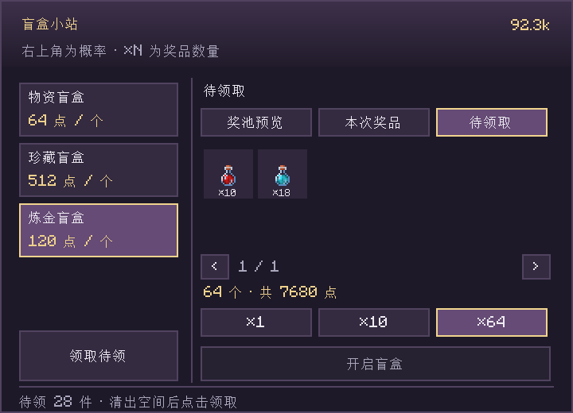

# 商店与盲盒配置 / Shop and mystery box configuration

服主可自定义商店上架内容、售价以及盲盒奖品、数量与概率。首次启动服务器或进入单人世界后，文件生成在游戏目录的 `config/` 中。配置由服务端读取，客户端打开商店时获取实际目录和奖池。

## 修改与重载

1. 备份要修改的 JSON 文件。
2. 用 UTF-8 保存；JSON 不支持 `//` 注释或末尾多余逗号，可用 `_comment` 字段写说明。
3. 执行 `/teamecon admin reload`（需要 OP 2），或重启服务器。已打开的商店也会更新目录。
4. 查看服务端日志，并在游戏中核对目录、价格及奖池悬停提示。非法商店配置会关闭物品购买，非法奖池会被禁用；修正后再次重载。

这些 JSON 位于游戏目录，而非每个存档目录；同一客户端实例的单人世界共用它们。起始余额、购买加价等 TOML 设置位于 `存档/serverconfig/teamecon-server.toml`，建议停服修改。不会自动覆盖服主已有的自定义 JSON。

## 游戏内定价面板

执行 `/teamecon admin prices`（OP 2）。分类标签来自创造模式物品栏；点击网格物品编辑，手持物品时自动选中。输入名称、注册 ID、全拼或拼音首字母可搜索全部物品。面板按物品注册 ID 定价，不区分药水、附魔或自定义数据变体；附魔书购买使用专用附魔目录。

购买与回收两个方向分别设置：沿用默认、不允许交易，或自定义正整数价格。点击保存后立即应用，点击恢复默认删除该物品的面板覆盖。「原规则参考值」来自基础材料与配方等已有规则；面板只覆盖该物品的交易价格，不改变其他配方的材料基础值。调整整条材料链仍使用 `teamecon_base_prices.json`。

文件在首次保存时创建：`config/teamecon_price_overrides.json`。

```json
{
  "version": 1,
  "items": {
    "minecraft:gold_ingot": {"buy": 200, "sell": 64},
    "create:iron_sheet": {"buy": 80, "sell": 20},
    "minecraft:diamond": {"buy": 0}
  }
}
```

- `buy`：玩家购买价；`sell`：系统基础回收价。缺省或 `-1` 沿用原配置，`0` 关闭，正整数设置价格（上限 1,000,000,000）。最多 4,096 项。
- 面板覆盖优先于目录中的商品价和下架设置；不绕过禁用物品、钱包等级、进度、阶段或设备底价。购买价仍不低于回收估价乘以 `shop.buyMarkup`，面板显示实际生效值。
- 原版回收默认规则保留。第三方回收默认关闭，只有明确的正数 `sell` 才能开启；仅接受与默认物品数据相同的物品。带自定义名称、附魔、额外库存或储能等非默认数据的变体不回收。本模组设备和票卡不回收。
- 文件只保存覆盖项。保存保留上一份 `.bak`，恢复默认只移除所选物品的覆盖。多人同时编辑时会拒绝旧修订；外部编辑文件后先执行 `/teamecon admin reload`。
- 非法覆盖文件会关闭物品买卖，修复并重载后恢复；失败的保存不会改动当前生效表。价格保存会重新检查盲盒和附魔书的价格约束。
- 本配置与其他 JSON 一样由游戏实例共用。实际回收仍计算市场需求；明确调低/调高单件价格可能影响合成路线收益，需要服主结合整合包配方选择。

English: `/teamecon admin prices` opens the operator-only creative-style editor with name, ID and pinyin search. `buy` and `sell` independently use missing/`-1` for inherited settings, `0` for disabled trading, or a positive custom price. Values override individual trades, not recipe anchors. Explicit mod recycling accepts default-state stacks only. Save applies immediately; external edits require `/teamecon admin reload`.

## 游戏内盲盒管理

`/teamecon admin boxes`（OP 2）打开容器式盲盒管理面板。左侧选择或新增箱种；右侧「箱种设置」填写唯一 ID、显示名称、单盒价格和可选阶段。中央上方是 9×6 奖品样板栏，下方是玩家背包。

- 将背包物品拖到样板格，或 Shift 点击背包物品快速添加。样板只记录配置，不消耗原物；拿在光标上的真实物品可放回背包，关闭界面也会按正常容器规则归还。
- 拖动样板可换位或交换，右键移除。选中样板后，在「奖品设置」修改数量并填写中奖百分比（如 `12.5`）；右键持有的真实物品放入样板格时记录 1 个。
- 奖品有 3 页，最多 128 项；空格只用于排版，不算空奖。保存后保留格子位置。未保存的编辑可取消。
- 安装 JEI 后，可从右侧物品列表直接拖入奖品格，无需作弊取物；未安装时使用背包拖放或 Shift 点击。支持默认状态物品、原版刷怪蛋（包括尸壳）与带具体效果的标准药水；改名、附魔或容器内容等额外数据会提示不支持。模组物品需开启对应箱种的允许选项。

每项概率范围为 `0–100`，最多六位小数；输入框也接受末尾的 `%`。修改一项后，其余奖品按原比例分配剩余概率；新增奖品分配 `100 ÷ 新奖品总数`，移除奖品后重新分配，合计保持 `100%`。仅一个奖品时为 `100%`，其余奖品原概率全为零时均分剩余比例。替换同格物品保留概率；`0%` 奖品保留样板但不被抽中。手动编辑 JSON 时仍须保证总和为 `100%`。

最后点击「保存」生效。

面板可启用/停用或删除箱种，删除需再次确认；也可开关第三方物品与价值校验。文件写入使用临时文件替换并保留 `.bak`。两个管理员同时编辑时，旧修订会被拒绝，需重新读取；外部修改文件后点击「重新读取配置」，或执行 `/teamecon admin reload`。保存只替换当前箱种，保留其他箱种和已有额外 JSON 字段。

## 自定义商店

文件：`config/teamecon_shop_catalog.json`。下面的完整例子只出售面包、铁锭和橡木原木：

```json
{
  "version": 1,
  "includeDefaultItems": false,
  "disabledItems": [],
  "items": [
    {"item": "minecraft:bread", "price": 40},
    {"item": "minecraft:iron_ingot", "price": 24},
    {"item": "minecraft:oak_log", "price": 8}
  ]
}
```

| 字段 | 含义 |
|---|---|
| `includeDefaultItems` | `true` 保留默认物品目录并叠加自定义项；`false` 仅上架 `items` 中的物品 |
| `disabledItems` | 精确物品 ID 数组，例如 `["minecraft:diamond"]`；优先于自定义项，仅限制购买，不禁止回收 |
| `items[].item` | 物品注册 ID，例如 `minecraft:bread`；也支持已安装的第三方模组物品 |
| `items[].price` | 每件购买价格，必须是正整数 |
| `items[].stage` | 可选的 FTB 阶段名称，默认为空；设置后需要阶段提供方确认解锁 |

默认 `includeDefaultItems=true`、两数组为空。删除自定义项后重载，该项恢复默认目录行为；要确保下架，应加入 `disabledItems` 或使用仅自定义模式。数组各最多 4,096 项，不支持通配符或标签；同一商品不能重复。

例如，安装相应模组后可添加 `{"item":"create:iron_sheet","price":80}`。没有安装的物品会记录日志且不会显示。第三方物品按明确的购买配置上架；目录文件只控制购买。回收需在定价面板中单独设置正数回收价。

自定义价格覆盖普通商店的稀有度购买底价，但仍不低于物品回收估价 × `shop.buyMarkup`。游戏机与终端仍受 `teamecon_casino_levels.json` 中的设备底价限制。价格和目录不会解除原有进度、钱包等级与 `sellOnly` 规则；这些在 `teamecon_progression.json` / `teamecon_casino_levels.json` 中分别配置。普通商店、终端及 `/teamecon buy` 共用同一目录和价格。

普通物品目录不负责附魔书或刮卡：附魔书使用 `teamecon_enchants.json`；八种票卡由专用购卡页生成有效票据。命令方块等受限原版物品、原版刷怪蛋和本模组内部物品不能通过目录放行。不支持自定义 NBT 或数据组件。

## 自定义盲盒

文件：`config/teamecon_blindbox.json`。下面完整例子创建一个建材箱，每次抽到一个奖项，原木概率 75%，铁锭概率 25%：

```json
{
  "version": 1,
  "pools": [
    {
      "id": "building",
      "price": 64,
      "enabled": true,
      "stage": "",
      "allowModdedItems": false,
      "enforceValueCap": true,
      "entries": [
        {"item": "minecraft:oak_log", "count": 16, "chance": 75},
        {"item": "minecraft:iron_ingot", "count": 4, "chance": 25}
      ]
    }
  ]
}
```

| 字段 | 含义 |
|---|---|
| `id` | 唯一箱子标识，1–32 位小写英文字母、数字或下划线；自定义箱以此标识显示 |
| `name` | 可选显示名称，最多 64 字符；ID 仍用于命令和配置引用。名称不含逗号、分号或控制字符 |
| `price` | 开启一个箱子的价格，必须是正整数 |
| `enabled` | 是否启用该箱，默认 `true` |
| `stage` | 可选阶段要求，默认空字符串；不要求原版进度或钱包等级 |
| `allowModdedItems` | 默认 `false`；显式设为 `true` 后允许已安装第三方模组的普通注册物品进入该奖池 |
| `enforceValueCap` | 默认 `true`，检查奖品按回收价计算的加权价值是否超过配置阈值；活动赠送箱可设为 `false`，不影响其他小游戏的阈值 |
| `entries[].item` | 奖品注册 ID；`minecraft:air` 表示空奖 |
| `entries[].slot` | 可选样板格位置，0–127，不能重复；只控制管理面板排版，不影响概率 |
| `entries[].potion` | 可选药水注册 ID，例如 `minecraft:long_fire_resistance`；仅适用于药水、喷溅药水、滞留药水或药箭 |
| `entries[].count` | 一次抽中交付的数量，默认 1，范围 1–2,304 |
| `entries[].chance` | 中奖百分比，JSON 数字 `0–100`，最多六位小数；同箱所有项合计必须为 `100` |
| `entries[].weight` | 相对权重格式：正整数，默认 1，最大 1,000,000；仅在同箱全部条目都未填写 `chance` 时使用 |

最多 64 个箱子，每箱最多 128 个奖项。相同物品可配置不同数量及概率；相同物品、药水效果与数量的概率会在界面中合并显示。数量、价格与 `weight` 必须为 JSON 整数；`chance` 可使用小数，所有这些数字都不能加引号。采用百分比格式时，每一项都要填写 `chance`，且不能混入 `weight`。

相对权重配置可继续读取。仅修改名称、价格、数量或摆放位置时保留原有概率；编辑概率或增减奖品时，面板将该箱转换为六位小数的百分比，舍入后合计保持 100%，正概率奖品至少保留 0.000001%。

设置 `allowModdedItems=true` 不会自动加入任何商品，也不会开启第三方物品回收。需要在 `entries` 中逐项写入奖品。默认友好／中立原版生物刷怪蛋可作奖品；受限原版物品、敌对原版刷怪蛋、本模组内部物品和空白票卡不可作奖品。物品必须在当前游戏版本及模组组合中存在。

缺失物品、负数、百分比合计不为 100、混用两种概率格式、零权重或非法条目会禁用对应整箱，避免悄悄删除某个奖项而改变概率；重复箱子 ID 会禁用整个文件。不会扣费发放无效奖品。空 `pools` 数组可关闭全部盲盒。原有顶层数组格式仍可读取，无需强制转换。

批量开启支持 1／10／64 个，按实际抽取结果统一扣款。能装入的奖品立即发放，剩余部分按购买者 UUID 保存在世界经济数据中；退出游戏和正常重启后仍可领取。玩家清出空间后，在任意盲盒机点击「领取待领」，或执行 `/teamecon claimboxes`。领取不会重新抽奖或收费；未领完上批奖品前不能继续开盒。即使对应箱种已删除或配置已修改，待领奖品仍保留原结果；卸载奖品所属模组时暂缓发放，恢复该模组后可继续领取。



药水奖项示例（同箱其他奖项还需分配剩余 95%；发放真实的抗火效果，预览也显示对应名称和颜色）：

```json
{"item": "minecraft:splash_potion", "potion": "minecraft:long_fire_resistance", "count": 2, "chance": 5}
```

玩家奖池中同一物品、药水效果及数量的重复条目合并显示，实际抽取概率显示在右上角；极小概率以 `<.01%` 显示，悬停可查看更高精度。批量开启不改变单盒概率。

## 附魔书和其他配置

`teamecon_enchants.json` 为附魔书数组：`id`（唯一标识）、`enchantment`（原版附魔 ID）、`level`、`price`、`stage`。删除条目即可下架；`[]` 关闭附魔书目录。等级不能超过该附魔原版上限，售价还受普通附魔书回收底价和 `teamecon_shop_prices.json` 约束。第三方附魔暂不支持。

`teamecon_shop_prices.json` 的 `minimumItemPrices` 与 `minimumEnchantmentPrices` 调整默认购买底价。删除自定义键并重载后恢复内置底价；将某键设为 `0` 可明确移除其稀有度底价，仍遵守基本买卖差价。

完整的经济、需求、设备及等级配置见[平衡配置指南](平衡配置指南.md)。

## English quick reference

Server-side files live in the game's `config/` directory. Edit UTF-8 JSON, then run `/teamecon admin reload` as OP 2. Open menus receive the updated catalogue. Back up edited files and check the server log for rejected entries.

- `teamecon_shop_catalog.json`: set `includeDefaultItems=false` for a custom-only item shop; list exact IDs in `disabledItems` to hide them. Add `{ "item": "namespace:item", "price": 80 }` to `items` for an explicit offer. An optional `stage` adds an FTB stage requirement. Installed third-party items are supported by explicit offers; recycling requires an explicit price in the pricing panel. Purchase prices retain the resale-price × markup floor and equipment floors; progression and sell-only rules still apply.
- `/teamecon admin boxes`: create/edit/delete box types in game. Drag or Shift-click inventory stacks into a 9×6 template grid, rearrange or remove templates without consuming the originals, then edit prices, potion variants and percentages. Enter 0–100 with up to six decimal places; other chances adjust proportionally to keep the total at 100%. New prizes receive an initial share automatically. With JEI installed, drag items directly from its sidebar without cheat mode. Save is immediate and keeps a backup. `/teamecon claimboxes` collects saved overflow rewards without another charge.
- `teamecon_blindbox.json`: optional `name` labels the box; `entries[].potion` selects the potion registry ID for potion items or tipped arrows. Overflow prizes remain in the buyer's saved pending list; finish claiming it before opening another batch. Use the complete `version` / `pools` example above. Each opening draws one `entries` row. `count` controls quantity; numeric `chance` is the exact percentage (0–100, up to six decimal places), and all entries must total 100. A zero chance never wins. Relative `weight` entries remain supported when no entry in that pool uses `chance`; the two formats cannot be mixed. Header-only edits preserve existing weights. `enabled=false` hides a pool. `allowModdedItems=true` permits explicitly listed installed third-party rewards. `enforceValueCap=false` opts that pool out of the weighted resale-value check. The legacy top-level array remains supported.
- Malformed item catalogues close item purchases; invalid reward pools are disabled without charging players. Missing mod items are logged. Duplicate pool IDs disable the entire pool file. Correct the file and reload to recover. No custom NBT/components are supported.

## 压缩材料基础估价 / Storage block values

金属块、钻石块、绿宝石块、红石块、煤炭块、青金石块与干草块，使用 `teamecon_base_prices.json` 中对应基础材料的九倍估价，不额外增加可逆压缩的合成加价。默认金锭 64 点，对应金块 576 点；出售时仍计算市场需求衰减，同等需求条件下，一个方块与九份原料的结算一致。若服主明确填写方块自身的基础价，以该覆盖值为准。修改后执行 `/teamecon admin reload`。

Storage blocks use nine times their configured raw material value without reversible crafting markup. Explicit block entries in `teamecon_base_prices.json` take precedence. Actual sale proceeds still include market demand adjustments. Reload after editing.
